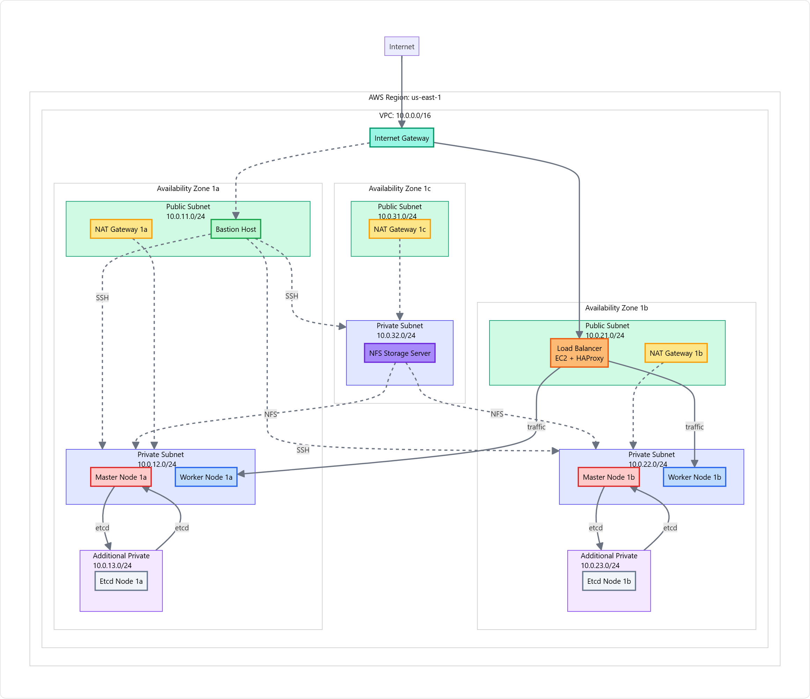

# Kubernetes Cluster Implementation
**Important:** IP addresses for all services (load balancer, masters, workers, etcd, apps) change every time you run `terraform apply`. 
**Always check and update `ansible/inventory.ini` with the latest IPs from `terraform output` before running any Ansible playbooks or accessing services.**
## Production-Read### Infrastructure Deployment
```bash
cd terraform
terraform init
terraform plan
terraform apply
```

### Update Inventory IPs After Terraform Changes
After running `terraform apply`, update the Ansible inventory with new IPs:

```bash
# Option 1: Automatic update (if Terraform outputs are configured)
cd terraform
chmod +x update-inventory.sh
./update-inventory.sh

# Option 2: Manual update - check outputs and edit ansible/inventory.ini
cd terraform
terraform output
```

**Note**: IP addresses change with each Terraform deployment. Always update `ansible/inventory.ini` with current IPs before running Ansible playbooks.netes Cluster on AWS

This project implements a production-ready Kubernetes cluster following the Medium guide: [Deploying a Production Kubernetes Cluster in 2023-2024](https://medium.com/@augustineozor/deploying-a-production-ready-kubernetes-cluster-in-2023-2024-a-step-by-step-guide-part-1-8f6b2e8c1c1a)

## 🏗️ Architecture Overview

```
Internet → Load Balancer (HAProxy) → [ETCD Cluster | K3s Masters | Workers]
                                      ↓
                               Shared Storage (iSCSI + OCFS2)
```

### 📋 Infrastructure Diagram
For a detailed visual representation of the infrastructure, see:
- **Interactive Diagram**: [infra_with_nfs.html](infra_with_nfs.html)
- **Static Image**: [kubernetes-infrastructure-nfs.png](kubernetes-infrastructure-nfs.png)



## 📊 Current Status

### ✅ COMPLETED & DEPLOYED COMPONENTS
- **Infrastructure**: VPC, subnets, security groups, EC2 instances (Terraform) ✅
- **HAProxy Load Balancer**: Configured for ETCD (2379), K8s API (6443), Dashboard (8443), Apps (30080/30081) ✅
- **ETCD Cluster**: 2-node cluster with TLS encryption ✅
- **K3s Kubernetes**: Masters and workers deployed with external etcd ✅
- **Kubernetes Dashboard**: Installed and exposed via HAProxy ✅
- **Security Groups**: Updated with proper access rules ✅
- **Certificate Management**: TLS certificates generated and distributed ✅
- **Sample Applications**: Simple web app and MongoDB + Mongo Express deployed ✅

### 🔄 IN PROGRESS
- **Storage**: iSCSI + OCFS2 shared storage pending
- **Monitoring**: Prometheus/Grafana stack
- **Backup**: ETCD and cluster backups

### 📍 DEPLOYMENT STATUS
Deployment IPs (examples, update after every Terraform apply):
- **ETCD Nodes**: See `terraform output etcd1_private_ip` and `etcd2_private_ip`
- **HAProxy Load Balancer**: See `terraform output load_balancer_public_ip`
- **K3s Masters**: See `terraform output master1_private_ip` and `master2_private_ip`
- **K3s Workers**: See `terraform output worker1_private_ip` and `worker2_private_ip`
- **ETCD Endpoint**: `https://<LB_IP>:2379` (LB IP from output)
- **K8s API**: `https://<LB_IP>:6443`
- **HAProxy Stats**: `http://<LB_IP>:8399/stats_secure`

## 🚀 Quick Start

### Prerequisites
- AWS CLI configured
- Terraform v1.0+
- Ansible v2.9+
- SSH key pair
- kubectl (optional, for direct cluster access)

### 1. Infrastructure Deployment
```bash
cd terraform
terraform init
terraform plan
terraform apply
```

### 2. Full Cluster Deployment
```bash
cd ansible
ansible-playbook -i inventory.ini playbooks/deploy-all.yml
```

### 3. Deploy Sample Applications
```bash
# Simple web app
ansible-playbook -i inventory.ini playbooks/deploy-app.yml

# MongoDB + Mongo Express
ansible-playbook -i inventory.ini playbooks/deploy-mongo.yml
```

### Individual Component Deployment
```bash
# ETCD cluster
ansible-playbook -i inventory.ini playbooks/etcd-playbook.yml

# HAProxy load balancer
ansible-playbook -i inventory.ini playbooks/haproxy-playbook.yml

# K3s masters
ansible-playbook -i inventory.ini playbooks/k3s-masters.yml

# K3s workers
ansible-playbook -i inventory.ini playbooks/k3s-workers.yml

# Kubernetes Dashboard
ansible-playbook -i inventory.ini playbooks/k8s-dashboard.yml
```

## 🌐 Access Points
## 🌐 Access Points

**Always use the latest IPs from `terraform output` and update `ansible/inventory.ini` before accessing any service!**

| Service                | URL (replace <LB_IP> with current)         | Credentials         |
|------------------------|--------------------------------------------|---------------------|
| Kubernetes Dashboard   | `https://<LB_IP>:8443`                     | Token from deployment|
| Simple Web App         | `http://<LB_IP>:30080`                     | -                   |
| Mongo Express          | `http://<LB_IP>:30081`                     | admin/express123    |
| HAProxy Stats          | `http://<LB_IP>:8399/stats_secure`         | admin/omar123       |
| K8s API                | `https://<LB_IP>:6443`                     | -                   |
| ETCD                   | `https://<LB_IP>:2379`                     | -                   |

Direct access (internal IPs):
- Master1: See `terraform output master1_private_ip`
- Master2: See `terraform output master2_private_ip`
- Worker1: See `terraform output worker1_private_ip`
- Worker2: See `terraform output worker2_private_ip`

## 📁 Project Structure

```
kubernetes_project/
├── terraform/                    # Infrastructure as Code
│   ├── main.tf                  # Main infrastructure
│   ├── variables.tf            # Input variables
│   ├── outputs.tf              # Output values
│   └── modules/
│       ├── vpc/                # Network configuration
│       ├── security_groups/    # Security rules
│       └── ec2_cluster/        # EC2 instances
├── ansible/                     # Configuration Management
│   ├── ansible.cfg             # Ansible configuration
│   ├── inventory.ini           # Host inventory
│   ├── files/                  # Static files and manifests
│   │   ├── mongo.yaml          # MongoDB deployment
│   │   ├── mongo-express.yaml  # Mongo Express deployment
│   │   ├── simple-app.yaml     # Simple web app
│   │   └── dashboard-admin-user.yaml # Dashboard admin user
│   ├── playbooks/              # Deployment playbooks
│   │   ├── deploy-all.yml      # Full deployment
│   │   ├── etcd-playbook.yml   # ETCD cluster
│   │   ├── haproxy-playbook.yml # Load balancer
│   │   ├── k3s-masters.yml     # K3s masters
│   │   ├── k3s-workers.yml     # K3s workers
│   │   ├── k8s-dashboard.yml   # Dashboard
│   │   ├── deploy-app.yml      # Simple app
│   │   └── deploy-mongo.yml    # MongoDB + Express
│   └── roles/                  # Ansible roles
│       ├── etcd/               # ETCD cluster role
│       ├── haproxy/            # HAProxy load balancer
│       ├── k3s_common/         # K3s common setup
│       ├── k3s_server/        # K3s master setup
│       └── k3s_agent/          # K3s worker setup
├── HANDOFF_SUMMARY.txt         # Project status for handoff
├── README.md                   # This file
└── usefullcommand.txt          # Useful commands reference
```

## 🔧 Configuration Details

### ETCD Configuration
- **Version**: 3.5.9
- **TLS**: Enabled with custom CA
- **Cluster**: 2 nodes (etcd1, etcd2)
- **Data Directory**: `/var/lib/etcd`
- **Client Port**: 2379
- **Peer Port**: 2380

### K3s Configuration
- **Version**: v1.33.4+k3s1
- **Datastore**: External ETCD via HAProxy
- **TLS SANs**: Includes HAProxy IP
- **Masters**: 2 nodes with embedded control plane
- **Workers**: 2 nodes

### HAProxy Configuration
- **Stats Port**: 8399
- **Frontends**: etcd, kube-api, dashboard, simple-app, mongo-express
- **Backends**: Round-robin to respective nodes
- **Health Checks**: Enabled for all services

### Security Groups
- **Bastion SG**: SSH access from anywhere
- **Private EC2 SG**: SSH from bastion, internal VPC traffic
- **Load Balancer SG**: HTTP/HTTPS, specific ports for services

## 🛠️ Troubleshooting

### Common Issues
1. **ETCD Permission Denied**: Check CA key permissions on controller
2. **K3s Service Not Starting**: Verify ETCD connectivity and TLS certs
3. **HAProxy Backend Down**: Check NodePort services on masters
4. **Dashboard Token Expired**: Re-run dashboard playbook

### Useful Commands
```bash
# Check cluster status
kubectl get nodes
kubectl get pods --all-namespaces

# Check ETCD health
etcdctl --endpoints=https://<LB_IP>:2379 --cacert=/etc/ssl/etcd/ca.crt --cert=/etc/ssl/etcd/server.crt --key=/etc/ssl/etcd/server.key endpoint health

# HAProxy stats
curl http://<LB_IP>:8399/stats_secure

# View logs
journalctl -u etcd -f
journalctl -u k3s -f
```

## 🔒 Security Considerations

- **TLS Everywhere**: ETCD, K8s API, and Dashboard use TLS
- **Certificate Management**: Custom CA with proper SANs
- **Network Security**: Security groups restrict access
- **Bastion Host**: SSH access through bastion only
- **Passwords**: Change default passwords in production

## 📈 Next Steps

1. **Storage Implementation**: Deploy iSCSI + OCFS2 shared storage
2. **Monitoring Stack**: Prometheus + Grafana
3. **Backup Strategy**: ETCD snapshots and cluster backups
4. **CI/CD Pipeline**: GitOps with ArgoCD
5. **Security Hardening**: Network policies, RBAC, secrets management

## 🤝 Contributing

1. Fork the repository
2. Create a feature branch
3. Make your changes
4. Test thoroughly
5. Submit a pull request

## 📄 License

This project is licensed under the MIT License - see the LICENSE file for details.

---

**Last Updated**: September 13, 2025
**Status**: Fully Deployed and Operational
└── README.md                   # This file
```

## 🔧 Components

### Infrastructure (Terraform)
- **VPC**: 10.0.0.0/16 with public/private subnets across 3 AZs
- **EC2 Instances**:
  - Bastion host (public)
  - Load balancer (public)
  - 2x ETCD nodes (private)
  - 2x Master nodes (private)
  - 2x Worker nodes (private)
  - Storage node (private)

### HAProxy Load Balancer
- **Ports**: 2379 (ETCD), 6443 (Kubernetes API), 8399 (Stats)
- **Features**: Health checks, round-robin load balancing
- **Stats Access**: http://lb-ip:8399/stats_secure (admin/omar123)

### ETCD Cluster ✅ OPERATIONAL
- **Version**: 3.5.9
- **Nodes**: 2 nodes (etcd1: 10.0.13.108, etcd2: 10.0.23.108)
- **Security**: TLS certificates for all communication
- **Status**: Both nodes active and healthy
- **Access**: Available through HAProxy at 18.209.164.58:2379
- **Health Checks**: Passing - cluster formation successful

## 🔒 Security Features

- **Network Security**: Security groups with minimal required access
- **SSH Access**: Only through bastion host
- **TLS Encryption**: ETCD with certificate-based authentication
- **Load Balancer Access**: Restricted to necessary ports

## 📈 Monitoring & Access

### HAProxy Statistics
- **URL**: http://[load-balancer-ip]:8399/stats_secure
- **Credentials**: admin / omar123
- **Features**: Real-time connection stats, backend health

### SSH Access Pattern
```bash
# Connect to bastion
ssh -i ~/.ssh/id_rsa ec2-user@bastion-ip

# From bastion, connect to private instances
ssh -i ~/.ssh/id_rsa ec2-user@private-instance-ip
```

## 🚧 Next Steps

1. **✅ ETCD Cluster - COMPLETED**
   - Both ETCD nodes deployed and operational
   - TLS certificates configured
   - HAProxy load balancer working
   - Cluster health verified

2. **🔄 Implement Kubernetes Masters - NEXT PRIORITY**
   - Create Ansible role for Kubernetes control plane
   - Configure master nodes to use ETCD cluster
   - Set up Kubernetes API server with ETCD endpoint: `https://18.209.164.58:2379`

3. **Deploy Worker Nodes**
   - Configure worker nodes
   - Join Kubernetes cluster

4. **Set up Shared Storage**
   - iSCSI target on storage node
   - OCFS2 filesystem
   - Mount on all nodes

5. **Configure Networking**
   - Calico/Cilium CNI
   - Network policies

6. **Deploy Monitoring**
   - Prometheus + Grafana
   - AlertManager

## 🐛 Troubleshooting

### Common Issues
- **SSH Connection Failed**: Check security groups and key permissions
- **Ansible Connection Error**: Verify inventory.ini IP addresses
- **HAProxy Not Accessible**: Check security group rules for port 8399

### Logs
```bash
# HAProxy logs
sudo journalctl -u haproxy -f

# ETCD logs
sudo journalctl -u etcd -f

# System logs
sudo journalctl -xe
```

## 📚 Resources

- [Medium Guide: Production Kubernetes Cluster](https://medium.com/@augustineozor/deploying-a-production-ready-kubernetes-cluster-in-2023-2024-a-step-by-step-guide-part-1-8f6b2e8c1c1a)
- [ETCD Documentation](https://etcd.io/docs/)
- [HAProxy Documentation](https://www.haproxy.org/)
- [Terraform AWS Provider](https://registry.terraform.io/providers/hashicorp/aws/latest)

## 🤝 Contributing

This project follows the implementation from the Medium guide. For questions or issues, please check the troubleshooting section or refer to the original guide.

---

**Status**: Infrastructure ✅ | HAProxy ✅ | ETCD ✅ | Kubernetes Masters 🔄 Next Phase
